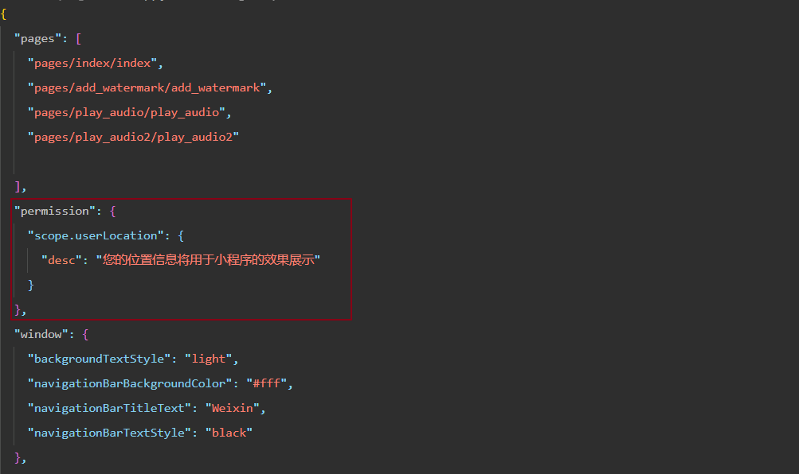
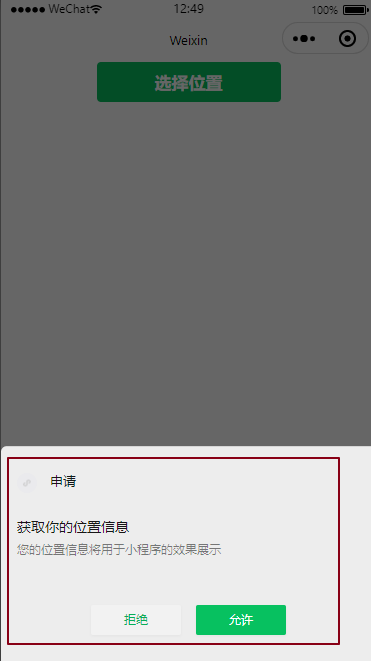
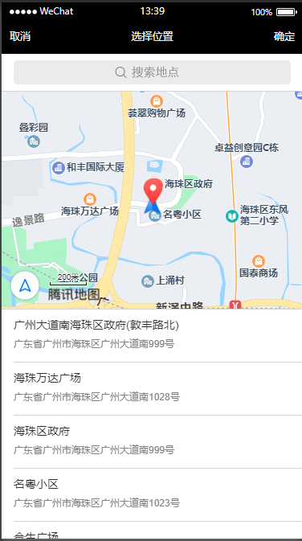
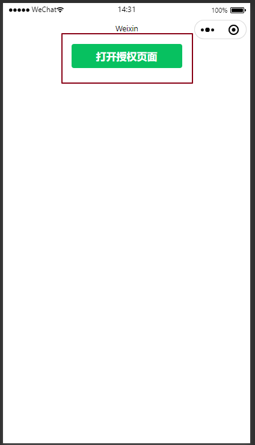
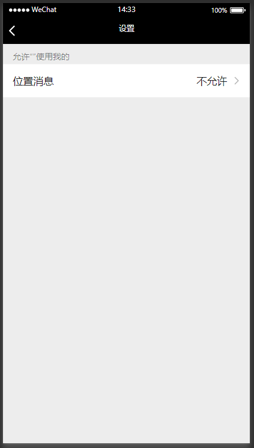
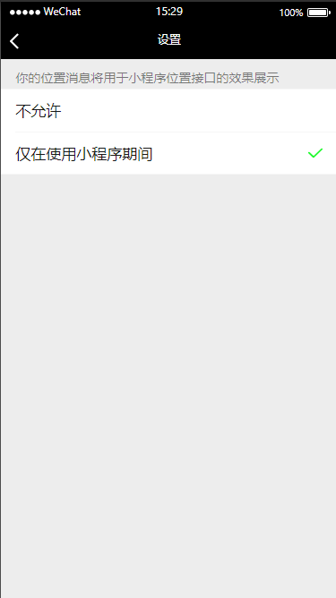
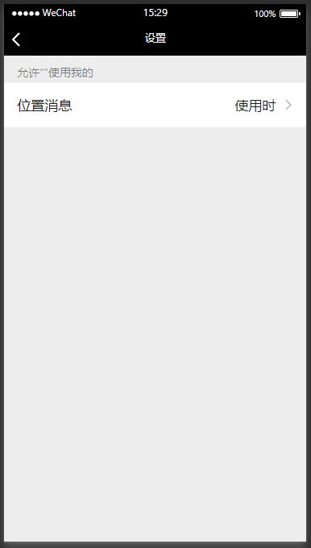
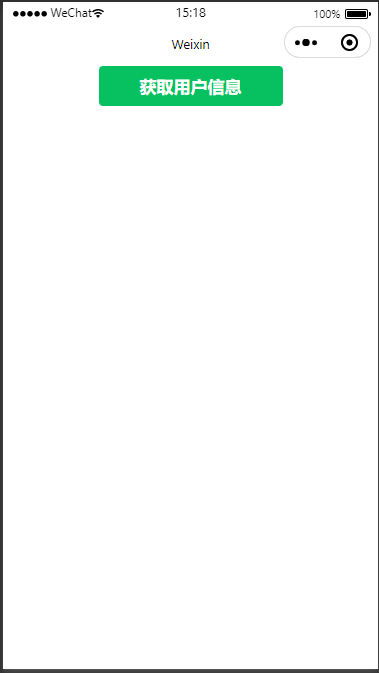
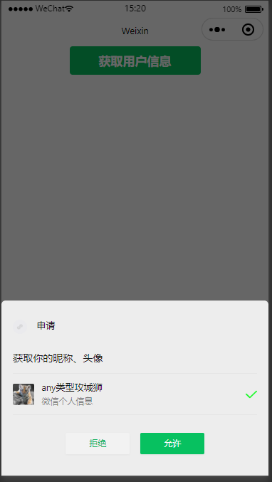

# 一、获取当前位置信息

有两种获取位置的方式，一种是 `直接返回经纬度等信息（必须代码处理后才能显示到界面上）`，另一种是 `"界面选择式" 由用户打开地图选择位置`。

## 第一步：授权配置

需要让用户**授权**，获取用户的位置信息

1、配置`app.json`文件，加入以下代码

```json
"permission": {
  "scope.userLocation": {
    "desc": "您的位置信息将用于小程序的效果展示"
  }
}
```



2、这样就完成了授权配置工作



## 第二步：获取位置

**获取地址的api有两个：**

### wx.getLocation

`wx.getLocation`：获取当前的地理位置、速度。[官方文档介绍](https://developers.weixin.qq.com/miniprogram/dev/api/location/wx.getLocation.html)

**代码实现：**


**返回结果：**


### wx.chooseLocation

`wx.chooseLocation`：打开地图选择位置。[官方文档介绍](https://developers.weixin.qq.com/miniprogram/dev/api/location/wx.chooseLocation.html)



**代码实现：**


**返回结果：**


### 注意：

如果用户拒绝授权后，之后调用接口不会弹出授权框，将会直接进入fail回调或者报错，这时，需要自己弹出提示框让用户去设置页面开启授权设置。

#### wx.openSetting

`wx.openSetting`：调起客户端小程序设置界面，返回用户设置的操作结果。注意：用户发生点击行为后，才可以跳转打开设置页，管理授权信息。[官方文档介绍]([wx.openSetting(Object object) | 微信开放文档 (qq.com)](https://developers.weixin.qq.com/miniprogram/dev/api/open-api/setting/wx.openSetting.html))

|  |  |
| ------------------------------------------------------------ | ------------------------------------------------------------ |

|  |  |
| ------------------------------------------------------------ | ------------------------------------------------------------ |

**代码实现：**


**返回结果：**


# 二、获取用户信息

## wx.getUserProfile

`wx.getUserProfile`：获取用户信息。页面产生点击事件（例如 `button` 上 `bindtap` 的回调中）后才可调用，每次请求都会弹出授权窗口，用户同意后返回 `userInfo`。[官方文档介绍](https://developers.weixin.qq.com/miniprogram/dev/api/open-api/user-info/wx.getUserProfile.html)

|  |  |
| ------------------------------------------------------------ | ------------------------------------------------------------ |


**代码实现：**


**返回结果：**


# 三、登录授权

小程序登录：小程序可以通过微信官方提供的登录能力方便地获取微信提供的用户身份标识。[官方文档介绍](https://developers.weixin.qq.com/miniprogram/dev/framework/open-ability/login.html)

## 小程序登录流程时序图

```mermaid
sequenceDiagram
	participant MP as 小程序<br>MiniProgram
	participant DS as 开发者服务器<br>Development Service
	participant WHA as 微信接口服务<br>Wechat Http Api
	MP ->> MP: wx.login() 获取 code
	MP ->> DS: wx.request() 发送 code
	DS ->> WHA: 登录凭证校验接口<br>appid + appsecret + code
	WHA ->> DS: session_key + openid 等
	DS ->> DS: 自定义登录态<br> 与openid，sesstion_key 关联
	DS ->> MP: 返回自定义登录态
	MP ->> MP: 自定义登录态存入storage
	MP ->> DS: wx.request() 发起业务请求<br>携带自定义登录态
	DS ->> DS: 通过自定义登录态<br> 查询openid 和 sesstion_key 
	DS ->> MP: 返回业务数据
	
```

## 说明

1. 调用 [wx.login()](https://developers.weixin.qq.com/miniprogram/dev/api/open-api/login/wx.login.html) 获取 **临时登录凭证code** ，并回传到开发者服务器。[官方文档介绍](https://developers.weixin.qq.com/miniprogram/dev/api/open-api/login/wx.login.html)
2. 调用 [auth.code2Session](https://developers.weixin.qq.com/miniprogram/dev/api-backend/open-api/login/auth.code2Session.html) 接口，换取 **用户唯一标识 OpenID** 、 用户在微信开放平台帐号下的**唯一标识UnionID**（若当前小程序已绑定到微信开放平台帐号） 和 **会话密钥 session_key**。[官方文档介绍](https://developers.weixin.qq.com/miniprogram/dev/api-backend/open-api/login/auth.code2Session.html)

虽然官方文档说`session_key`不应该下发到小程序端，但是为了方便后面的使用，我们这里后端直接把`openid, session_key， unionid`返回前端使用了。


**代码实现：**


**返回结果：**


后端请求https://api.weixin.qq.com/sns/jscode2session?appid=<AppId>&secret=<AppSecret>&js_code=<code>&grant_type=authorization_code

AppId和AppSecret是微信鉴别开发者身份的重要信息，AppId是公开信息，泄露AppId不会带来安全风险，但是AppSecret是开发者的隐私数据不应该泄露，如果发现泄露需要到小程序管理平台进行重置AppSecret，而code在成功换取一次信息之后也会立即失效，即便凭证code生成时间还没过期。

**返回结果：**


# 四、获取手机号码

获取手机号：因为需要用户主动触发才能发起获取手机号接口，所以该功能不由 API 来调用，需用 [button](https://developers.weixin.qq.com/miniprogram/dev/component/button.html) 组件的点击来触发。[官方文档介绍](https://developers.weixin.qq.com/miniprogram/dev/framework/open-ability/getPhoneNumber.html)

**注意：目前该接口针对非个人开发者，且完成了认证的小程序开放（不包含海外主体）。需谨慎使用，若用户举报较多或被发现在不必要场景下使用，微信有权永久回收该小程序的该接口权限。**

### 使用方法

需要将 [button](https://developers.weixin.qq.com/miniprogram/dev/component/button.html) 组件 `open-type` 的值设置为 `getPhoneNumber`，当用户点击并同意之后，可以通过 `bindgetphonenumber` 事件回调获取到微信服务器返回的加密数据， 然后在第三方服务端结合 `session_key` 以及 `app_id` 进行解密获取手机号。

**代码实现：**


**返回结果：**

触发`getPhoneNumber返回的e.detail数据`


**返回参数说明**

| 参数          | 类型   | 说明                                                         | 最低版本                                                     |
| :------------ | :----- | :----------------------------------------------------------- | :----------------------------------------------------------- |
| encryptedData | String | 包括敏感数据在内的完整用户信息的加密数据，详细见[加密数据解密算法](https://developers.weixin.qq.com/miniprogram/dev/framework/open-ability/signature.html#加密数据解密算法) |                                                              |
| iv            | String | 加密算法的初始向量，详细见[加密数据解密算法](https://developers.weixin.qq.com/miniprogram/dev/framework/open-ability/signature.html#加密数据解密算法) |                                                              |
| cloudID       | string | 敏感数据对应的云 ID，开通云开发的小程序才会返回，可通过云调用直接获取开放数据，详细见[云调用直接获取开放数据](https://developers.weixin.qq.com/miniprogram/dev/framework/open-ability/signature.html#method-cloud) | 基础库 [2.8.0](https://developers.weixin.qq.com/miniprogram/dev/framework/compatibility.html) |

前端将`encryptedData，iv，以及前面登录授权获取的session_key发送给后端解密`，服务端返回解密后的数据如下所示


